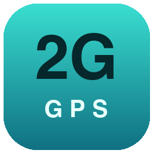

<p align="center">
  
</p>

<h1 align="center">2G Connector</h1>

<p align="center">
  Conector Windows que transmite a posição do <b>Microsoft Flight Simulator 2020/2024</b>
  para o seu EFB, usando o protocolo <b>XGPS</b> (broadcast UDP, porta 49002).
</p>

<p align="center">
  <a href="https://github.com/galenoferreira/gps_connector/releases/latest"></a>
  
  
</p>

---

## EFBs suportados

| EFB | Configuração necessária |
|---|---|
| **2G Pilot EFB** | Nenhuma — basta estar na mesma rede Wi-Fi do PC |
| **ForeFlight** | Nenhuma — o dispositivo aparece sozinho em **More → Devices** |

Voando, o EFB passa a usar a posição do simulador no lugar do GPS do aparelho.
No ForeFlight, a barra de instrumentos mostra a precisão identificada pelo nome do
dispositivo (ex.: *Accuracy (2G Connector)*), e a atitude enviada alimenta o
horizonte do Synthetic Vision.

> Outros EFBs que leem o protocolo XGPS na porta 49002 tendem a funcionar, mas
> não são testados nem oficialmente suportados.

## Simuladores suportados

| Simulador | Como conecta | Situação |
|---|---|---|
| **MSFS 2024** (Store e Steam) | SimConnect | ✅ Suportado |
| **MSFS 2020** (Store e Steam) | SimConnect | ✅ Suportado |
| **Prepar3D v4 / v5 / v6** | SimConnect | 🧪 **Experimental** — não validado com o simulador real |
| **X-Plane 11 / 12** | UDP (beacon + datarefs) | 🧪 **Experimental** — não validado com o simulador real |
| FSX, Prepar3D v1–v3 | — | ❌ Fora de escopo (SimConnect só 32 bits) |

Não há nada a escolher: o app procura os três ao mesmo tempo e usa o que
responder — inclusive um X-Plane rodando em **outra máquina da rede**, que ele
descobre sozinho pelo beacon multicast.

Se você testar o Prepar3D ou o X-Plane,
[conte como foi](https://github.com/galenoferreira/gps_connector/issues) — a tela
mostra qual simulador foi detectado e se a conexão foi aceita. Detalhes técnicos e
decisões no [estudo multi-simulador](docs/estudo-multi-simulador.md).

<details>
<summary>X-Plane: alternativa sem instalar nada</summary>

O X-Plane já sabe transmitir XGPS/XATT sozinho: *Settings → Network → "iPhone,
iPad and External Apps"*, marcando o broadcast para apps de mapa. Funciona sem
este conector.

O que você ganha usando o 2G Connector: o dispositivo aparece no EFB com o nome
que você escolher (padrão **"2G Connector"**) em vez de **"1"** (o X-Plane se
anuncia como `XGPS1`), não precisa achar a opção nos ajustes, e você pode enviar
para um IP específico em outra sub-rede. O que você perde: o caminho nativo tem
precisão um pouco melhor (~1,5 m contra o float32 do protocolo de datarefs),
diferença irrelevante para um mapa móvel.

</details>

## Como funciona

```
MSFS · Prepar3D ──SimConnect──┐
                              ├─▶ 2G Connector ──UDP 49002 (XGPS/XATT)──▶ EFB
X-Plane ──────────UDP RREF────┘
```

- **Conexão automática**: o app procura todos os simuladores ao mesmo tempo e usa
  o que responder — pode abrir o simulador antes ou depois, tanto faz. Um único
  binário atende MSFS 2020/2024, Prepar3D e X-Plane.
- **Transmissão**: posição (`XGPS`) e atitude (`XATT`) por broadcast dirigido em
  todas as interfaces de rede ativas, mais unicast opcional para IPs específicos.
  Padrão de 3 Hz, ajustável na interface (0,5 a 10 Hz).
- **Descoberta automática do EFB**: acha o app na rede e passa a mandar unicast
  direto para ele, *somando* ao broadcast. Ver [Descoberta automática](#descoberta-automática-do-efb).
- **Pausa inteligente**: com o simulador pausado ou no menu, a transmissão para e
  retoma sozinha quando o voo volta — o EFB não fica com a aeronave congelada.
- **Iniciar junto com o MSFS**: registra-se no `EXE.xml` do simulador com merge
  seguro e backup, sem tocar nas entradas de outros add-ons. Se um update do MSFS
  apagar o registro, ele se refaz na execução seguinte.
- **SYNC PV to 2G Pilot**: um clique lê o plano de voo ativo no simulador e o
  entrega ao EFB. Ver [Sincronizar plano de voo](#sincronizar-plano-de-voo).
- **Controle pelo 2G Pilot**: o iPad pareado sintoniza os rádios do simulador e vê o
  que está no cockpit. Ver [Controle pelo 2G Pilot](#controle-pelo-2g-pilot).
- **Bandeja do sistema**: fechar a janela mantém a transmissão ativa em segundo
  plano; para encerrar de fato, use **Sair** no menu da bandeja.
- **Atualização automática**: baixa versões novas em segundo plano, verificadas
  por assinatura digital, e só instala fora de voo. Ver [Atualização automática](#atualização-automática).

## Descoberta automática do EFB

O conector encontra o 2G Pilot sozinho e passa a transmitir **unicast direto para
o IP do app, além do broadcast** — os dois em paralelo, nunca um no lugar do
outro. Cada caminho cobre uma falha do outro:

- o **unicast** é o único que atravessa um roteador com *isolamento de clientes*
  ligado, situação em que broadcast simplesmente não chega ao tablet;
- o **broadcast** é o único que resta quando a descoberta não acontece — Bonjour
  bloqueado, app recém-aberto, rede estranha.

Se a descoberta falhar no meio de um voo o piloto não pode perder posição, e o
custo de um envio a mais numa rede local não paga esse risco.

### Os dois caminhos

**Bonjour.** O app publica `_2gpilot._udp.` na porta 49002 enquanto está
escutando. O conector pergunta por esse serviço a cada 10 s e usa o IP de quem
responder. É o mais robusto: acha o app sem depender de ele ter recebido nada
antes.

**Anúncio na UDP 63093.** A cada 5 s o app emite
`{"App":"2G Pilot","GDL90":{"port":4000}}`, inclusive de volta para quem
transmitiu. O IP de origem desse datagrama é o endereço do app. O conector
escuta essa porta e não precisa de mais nada.

Os dois alimentam a mesma lista, sem duplicar endereço. O destino é solto após
**30 segundos** sem sinal, e aí o broadcast volta a ser o único caminho até o app
reaparecer. Cabem até **4 apps** ao mesmo tempo — dois iPads na mesma cabine é
caso real.

Não há nada para configurar. O painel **Diagnóstico** mostra quantos apps foram
descobertos, em quais IPs, por qual caminho e há quantos segundos cada um se
manifestou — sem isso não haveria como o piloto conferir se funcionou.

> As portas não mudam: `XGPS`/`XATT` continuam na 49002, agora também em unicast.
> O campo `GDL90.port` do anúncio é lido e guardado, mas o conector ainda não
> transmite GDL 90 — quando transmitir, o destino já estará conhecido.

## Sincronizar plano de voo

Com o simulador conectado, o botão **SYNC PV to 2G Pilot** lê a rota ativa e a
disponibiliza ao EFB — sem redigitar waypoint por waypoint.

| Simulador | De onde vem a rota | Observação |
|---|---|---|
| MSFS 2020/2024 | `.PLN` do voo em curso, caminho informado pelo próprio SimConnect | Automático |
| Prepar3D | Mesmo formato `.PLN` | Automático |
| X-Plane | `.fms` mais recente em `Output/FMS plans` | **Salve a rota no X-Plane antes**, e só funciona com ele nesta mesma máquina |

### Como o EFB recebe

O plano não cabe num datagrama UDP e UDP não garante entrega, então o conector
**anuncia** por UDP e **serve** por HTTP:

1. O conector publica o plano em `http://<ip-do-pc>:49003/flightplan`
2. Envia no canal UDP 49002, que o EFB já escuta:
   `2GFPL<nome-do-dispositivo>,<versão>,<url>`
3. O EFB faz `GET` na URL e recebe:

```json
{
  "schemaVersion": 1,
  "source": "MSFS 2024",
  "generatedUtc": "2026-08-20T18:40:00Z",
  "departure": "SBSP",
  "destination": "SBRJ",
  "cruiseAltitudeFt": 12000,
  "waypoints": [
    { "id": "SBSP", "type": "Airport", "lat": -23.626667, "lon": -46.656111, "altFt": 2630 }
  ]
}
```

`type` assume `Airport`, `Ndb`, `Vor`, `Intersection`, `User` ou `Unknown`. `altFt`
é omitido quando o plano não define altitude para o waypoint. Suba `schemaVersion`
a cada mudança incompatível.

## Controle pelo 2G Pilot

O 2G Pilot pode sintonizar os rádios do simulador — COM1/COM2, NAV1/NAV2, ADF,
transponder e altímetro — e mostra sempre o que está de fato no cockpit. Funciona
com MSFS 2020, MSFS 2024 e Prepar3D (este, experimental como o resto do suporte a
ele, e sem o modo do transponder, que o Prepar3D não modela).

**Parear um iPad, uma vez:**

1. No 2G Connector, clique em **Parear aparelho**. Aparece um código de 6 dígitos,
   válido por 2 minutos, para um único pareamento; cinco tentativas erradas o anulam.
2. No 2G Pilot, escolha o Connector na lista e digite o código.

Depois disso o aparelho conecta sozinho. A lista de aparelhos pareados fica no card
**Controle pelo 2G Pilot**, com o botão **Remover**, que derruba na hora a conexão do
aparelho — para voltar, ele precisa parear de novo. Cabem 4 conexões ao mesmo tempo.
Para desligar o controle de vez: **Configurações → Permitir controle pelo 2G Pilot**
(a porta nem abre, e os pareamentos continuam guardados).

O que o app vê em cada situação:

- **Sem simulador conectado**, o comando é recusado com `sim_not_connected`.
- **Com o X-Plane**, o app vê o simulador, mas ainda sem rádios — eles chegam com o
  [spec 03](docs/2g-connector-controles/03-radios-xplane.md). Até lá, os comandos
  voltam `unsupported`.
- **Troca de aeronave ou de simulador**: a lista de controles e o estado são
  reenviados sozinhos ao app.

Como funciona: a cada 5 s o Connector anuncia o canal na UDP 49002, pelos mesmos
destinos do XGPS, com `2GCTL<nome>,1,ws://<ip>:49004/control`. O IP da URL é o da
placa por onde aquele anúncio sai — o que a rota do Windows escolheria, com a
sub-rede como reserva —, então um PC com Wi-Fi e cabo anuncia o endereço certo em
cada rede. O canal é WebSocket na TCP 49004 (**Configurações → Porta do controle
(TCP)**). O app manda só o ID do controle e um número inteiro (Hz, Pa, código do
transponder); a tradução para o simulador é do Connector. O protocolo e o contrato
para o app estão no [spec 01](docs/2g-connector-controles/01-canal-de-controle.md),
com a visão geral em [docs/2g-connector-controles](docs/2g-connector-controles/00-visao-geral.md).

Aeronaves de terceiros com rádios próprios (Fenix, PMDG e muitas do MSFS 2024) podem
ignorar os comandos padrão: o 2G Pilot avisa quando o rádio não mudou. O suporte a
elas vem com os perfis de aeronave
([spec 04](docs/2g-connector-controles/04-perfis-e-modulo-msfs.md)).

## Download

Links **permanentes** — sempre entregam a versão mais recente, sem precisar de
atualização a cada release:

| Link | Para quem |
|---|---|
| [**2G-Connector.exe**](https://github.com/galenoferreira/gps_connector/releases/latest/download/2G-Connector.exe) | **Recomendado** — executável único, sem instalação |
| [2G-Connector.zip](https://github.com/galenoferreira/gps_connector/releases/latest/download/2G-Connector.zip) | Mesmo executável, compactado |
| [2G-Connector-Setup.exe](https://github.com/galenoferreira/gps_connector/releases/latest/download/2G-Connector-Setup.exe) | Instalador com atalho no Menu Iniciar e desinstalador |
| [Página de releases](https://github.com/galenoferreira/gps_connector/releases/latest) | Notas da versão e checksums SHA-256 |

## Instalação

**Não há instalação.** Baixe o `.exe` e execute — um arquivo só, sem pasta de
dependências e sem instalador.

- **Zero pré-requisitos**: o runtime .NET e o Visual C++ Redistributable viajam
  dentro do executável.
- Não requer administrador.
- Na primeira execução o Windows pode pedir permissão de firewall, porque o app
  escuta o anúncio do X-Plane na rede, serve o plano de voo na porta 49003 e o
  canal de controle na 49004. Permitir é necessário para **detectar o X-Plane**,
  para o **SYNC PV** e para o **controle pelo 2G Pilot**; o envio de posição ao EFB
  é de saída e funciona mesmo se você negar.
- Rode de onde quiser: Desktop, Downloads, pendrive.
- Detecta o MSFS sozinho, em tempo de execução. Se você mover o `.exe` de lugar,
  o "Iniciar junto com o MSFS" se reajusta na próxima abertura.

<details>
<summary>O que o app grava fora do .exe</summary>

| Caminho | Conteúdo |
|---|---|
| `%APPDATA%\2G Connector\settings.json` | Suas configurações (copiadas da pasta `2G GPS Cliente` na primeira execução, se existir) |
| `%APPDATA%\2G Connector\paired-devices.json` | Aparelhos pareados para o controle pelo 2G Pilot — do token, só o hash SHA-256 |
| `%LOCALAPPDATA%\2G Connector\runtime\<versão>\` | DLLs do SimConnect e do runtime C++, extraídas na 1ª execução |
| `%LOCALAPPDATA%\2G Connector\updates\` | Atualização baixada e verificada, aguardando instalação |
| `%LOCALAPPDATA%\2G Connector\erro.log` | Só se ocorrer um erro inesperado |
| `EXE.xml` do MSFS | Só se "Iniciar junto com o MSFS" estiver marcado |

A primeira execução é um pouco mais lenta, porque o executável se descompacta;
as seguintes são normais.

</details>

> **Aviso SmartScreen**: builds sem assinatura digital exibem *"O Windows protegeu
> seu computador"* — clique em **Mais informações → Executar assim mesmo**. É o
> comportamento padrão do Windows para executáveis novos não assinados.

## Atualização automática

A partir da v1.4.0 o 2G Connector se atualiza sozinho — e **nunca durante um voo**.

- Verifica um minuto depois de abrir e a cada 6 horas, e baixa em segundo plano.
  Religar **Atualizar automaticamente** e clicar em **Aplicar** também verifica
  na hora.
- Com a versão nova baixada, aparece uma faixa abaixo do cabeçalho
  (*"v1.4.1 pronta — instala ao reiniciar"*) com o botão **Atualizar agora**.
- Instala só em três momentos:
  - **ao abrir**, antes de conectar ao simulador — e reabre do mesmo jeito que
    foi aberto (minimizado, se foi o MSFS que o lançou);
  - **ao encerrar** pelo **Sair** da bandeja (ou fechando a janela com *Fechar
    para a bandeja* desmarcado) — instala e **não** reabre;
  - quando você clica em **Atualizar agora** — em voo, ele pergunta antes; a
    versão nova reabre com a janela à vista, salvo com **Iniciar minimizado**
    marcado (aí ela volta direto para a bandeja).

  Logoff e desligamento do Windows nunca instalam.
- Todo download é verificado antes de instalar: o manifesto do release é assinado
  digitalmente, a versão precisa ser mais nova que a instalada e o arquivo precisa
  bater com o tamanho e o hash SHA-256 declarados. Qualquer falha descarta o
  download e aparece no painel **Diagnóstico**, que também mostra a última
  verificação e a versão mais recente vista.
- Cada versão tem no máximo **duas tentativas** de instalação. Se as duas falharem,
  ela deixa de ser tentada: a faixa passa a dizer *"baixe manualmente"*, com o link
  **Abrir a página de download** (página do release mais recente), e o
  Diagnóstico registra a falha.
- Quem instalou pelo `2G-Connector-Setup.exe` é atualizado pelo instalador novo, em
  modo silencioso e sem pedir administrador. No `.exe` avulso, a versão nova
  substitui o arquivo no mesmo lugar (o antigo fica como `2G-Connector.exe.old`
  até a próxima abertura, que o apaga), então o "Iniciar junto com o MSFS"
  continua apontando para o lugar certo.
- Se o `.exe` estiver numa pasta onde o app não pode gravar, ele não baixa nada:
  a faixa avisa que há versão nova e mostra o mesmo link para baixar manualmente.
- Para desligar: **Configurações → Atualizar automaticamente**. Desligado, o app
  não verifica, não baixa e não instala sozinho; uma versão que já estava baixada
  ainda pode ser instalada pelo botão **Atualizar agora**.

### Vindo da v1.3.0 (2G GPS Cliente)

Quem está na v1.3.0 ou anterior atualiza manualmente uma última vez, baixando o
arquivo novo do mesmo tipo que já usa. A configuração e o registro no MSFS são
migrados sozinhos:

- as configurações são copiadas da pasta `2G GPS Cliente` na primeira execução. A
  pasta antiga fica intacta, então voltar à v1.3.0 continua funcionando. O nome de
  dispositivo não muda: quem atualiza continua aparecendo no EFB como antes
  (*2G GPS*, se nunca trocou); o padrão *2G Connector* vale só para instalação nova;
- no `EXE.xml` do MSFS, a entrada `2G GPS Cliente` dá lugar à `2G Connector`;
- o instalador atualiza a instalação existente, na mesma pasta, e apaga o
  `2G-GPS-Cliente.exe`, os atalhos antigos e o valor `2G GPS Cliente` do "iniciar
  com o Windows". Se você tinha desabilitado o conector na aba *Aplicativos de
  inicialização* do Gerenciador de Tarefas e mantiver a opção de iniciar com o
  Windows, ele continua desabilitado lá. Ao terminar, o instalador já registra o
  exe novo no `EXE.xml` (se "Iniciar junto com o MSFS" estiver ligado), sem
  precisar abrir o app.

Abrir o exe antigo por engano não duplica a transmissão: as duas versões dividem a
mesma trava de instância única, e só uma sobe.

## Solução de problemas

Abra o painel **Diagnóstico** na janela do app antes de mexer em firewall ou
roteador. Ele mostra três coisas que respondem quase toda dúvida de rede:

- **Destinos dos pacotes** — os endereços para onde o app está de fato enviando.
- **Interfaces de rede deste PC** — o IP e a sub-rede de cada adaptador ativo.
  Compare com o IP do tablet (*Ajustes → Wi-Fi → ⓘ*): sub-redes diferentes
  significam que o broadcast nunca teve chance de chegar.
- **Contadores** — `enviados`, `falhas` (erros de socket, ou seja, o pacote nem
  saiu da máquina) e `amostras inválidas` (o simulador mandou NaN/Infinity e o
  dado foi descartado antes de virar sentença).

| Sintoma | Causa provável |
|---|---|
| EFB não recebe posição | Tablet em outra rede/sub-rede Wi-Fi, ou o roteador/AP está com "isolamento de clientes" (AP/client isolation) ligado |
| Tablet em sub-rede diferente | Informe o IP do tablet em **Configurações → IPs adicionais** (unicast) |
| Roteador com isolamento de clientes | A [descoberta automática](#descoberta-automática-do-efb) resolve: o unicast passa onde o broadcast não passa. Confira no Diagnóstico se o IP do tablet aparece em "apps descobertos" |
| Nenhum app descoberto | O app precisa estar aberto e escutando. Bonjour bloqueado por firewall ainda deixa o anúncio da 63093 funcionar, e vice-versa — basta um dos dois |
| Posição congela no EFB | Simulador pausado ou no menu — normal; retoma sozinho no voo |
| Posição congela mas o contador de pacotes sobe | O pacote sai e some no caminho: veja `falhas` no Diagnóstico e confirme a sub-rede; muitos APs descartam broadcast para clientes Wi-Fi em economia de energia — a saída é o unicast para o IP do tablet |
| `amostras inválidas` subindo no Diagnóstico | O simulador está entregando valores não-finitos (respawn, transição de mundo). O app descarta e a transmissão pausa até o dado voltar ao normal |
| Recebe em um EFB mas não em outro | Porta 49002 ocupada por outro conector — feche outras pontes de GPS |
| X-Plane não é detectado | O beacon dele é bloqueado pelo firewall: libere o app para redes privadas, ou use o broadcast nativo do X-Plane (acima) |
| SYNC PV não acha o plano | No MSFS/P3D, crie a rota antes de iniciar o voo; no X-Plane, salve-a em `Output/FMS plans` |
| EFB não busca o plano anunciado | Porta TCP 49003 bloqueada pelo firewall — libere o app para redes privadas |
| O 2G Pilot não encontra o Connector para controlar | Confira se "Permitir controle pelo 2G Pilot" está ligado e se o card mostra "Aguardando aparelho". Porta TCP 49004 bloqueada pelo firewall: libere o app para redes privadas |
| Card do controle mostra "Canal de controle indisponível" | Outro programa ocupa a porta TCP do controle (o motivo aparece no card e no Diagnóstico). Troque em **Configurações → Porta do controle (TCP)** e clique em **Aplicar** |
| O comando chega mas o rádio não muda | A aeronave ignora os eventos padrão do SimConnect (comum em aeronaves de terceiros) — ver [spec 04](docs/2g-connector-controles/04-perfis-e-modulo-msfs.md) |
| Com o X-Plane, o 2G Pilot não muda os rádios | Esperado: os rádios do X-Plane ainda não entram no canal e os comandos voltam `unsupported` ([spec 03](docs/2g-connector-controles/03-radios-xplane.md)) |
| "Falha ao inicializar o SimConnect" | Consulte `%LOCALAPPDATA%\2G Connector\erro.log` e [abra uma issue](https://github.com/galenoferreira/gps_connector/issues) com a mensagem |
| Faixa "falhou 2 vezes — baixe manualmente" | A instalação automática dessa versão falhou nas duas tentativas e não será tentada de novo. Baixe pelo link da faixa |
| Faixa "baixe manualmente (pasta do app sem permissão de escrita)" | O `.exe` está numa pasta onde o app não pode gravar. Mova-o para uma pasta sua (Desktop, Documentos) ou baixe pelo link da faixa |
| Atualização não chega | No Diagnóstico, a linha **Atualização** mostra a última verificação e a versão mais recente vista; o último erro (sem acesso ao feed, assinatura inválida, hash que não confere) aparece em vermelho no fim do painel |

## Desenvolvimento

```
src/TwoG.Connector/          App WPF (.NET 10, x64) — UI, SimConnect, broadcaster, updater
src/TwoG.Connector.Core/     Lógica pura (multiplataforma, testável): protocolo, EXE.xml,
                             identidade do produto, manifesto/assinatura/política do updater,
                             canal de controle (servidor WebSocket, pareamento, catálogo de rádios)
tests/                       Testes de unidade do Core
tools/                       ReleaseSigner: gera e assina o update.json no CI
libs/                        DLLs do SimConnect (MSFS SDK) e do runtime VC++ x64
installer/setup.iss          Instalador Inno Setup (opcional)
```

```bash
dotnet test tests/TwoG.Connector.Core.Tests/TwoG.Connector.Core.Tests.csproj
```

```bash
dotnet publish src/TwoG.Connector/TwoG.Connector.csproj -c Release -o publish
```

Ambos rodam em qualquer sistema operacional — o csproj traz `EnableWindowsTargeting`
e RID fixo `win-x64`, então o publish gera o `.exe` até a partir de macOS/Linux.
O binário, porém, só **executa** no Windows: o SimConnect é x64/Windows.

### Publicar uma versão

```bash
git tag v1.4.1 && git push origin v1.4.1
```

Um push de tag `v*` gera o release. O CI roda os testes, publica o executável único,
**valida que a saída tem exatamente 1 arquivo**, compila o instalador, assina o
manifesto do updater, gera os checksums e cria o Release com notas automáticas. A
versão da tag vira a versão do binário, e só builds de tag levam o canal do updater
(`-p:UpdateChannel=stable`): build local e de branch nunca se atualizam, e o
Diagnóstico mostra isso.

O CI assina o `update.json` com o secret `UPDATE_SIGNING_KEY` e **falha** se ele não
existir ou não bater com a chave pública em `src/TwoG.Connector.Core/UpdateKeys/`.
O release leva `update.json` e `update.json.sig` ao lado dos binários; na linha
1.4.x, também cópias com os nomes da v1.3.0 (`2G-GPS-Cliente*`), para link salvo não
dar 404.

Para testar o updater sem mexer no `latest`, publique um pré-release
(`v1.4.1-rc.1`) e aponte um app instalado para ele com a variável de ambiente
`TWOG_UPDATE_FEED=https://github.com/galenoferreira/gps_connector/releases/download/v1.4.1-rc.1/update.json`
(só HTTPS; a assinatura continua obrigatória). O `.env.example` lista essa e as
demais variáveis locais de manutenção — copie para `.env`, que o git ignora, e
nunca coloque nele o conteúdo de uma chave, só o caminho.

Os arquivos do Release **não levam versão no nome** — é o que mantém os links de
download permanentes válidos. Tags com hífen (`v1.4.1-rc.1`) entram como
pré-release e não assumem o `latest`, preservando esses links.

### Como o .exe único funciona

O publish usa `PublishSingleFile` + `IncludeNativeLibrariesForSelfExtract` +
`EnableCompressionInSingleFile`, definidos no csproj. As DLLs do SimConnect ficam
**fora** do bundle: o wrapper gerenciado é *mixed-mode* C++/CLI, e a
[documentação da Microsoft](https://learn.microsoft.com/en-us/dotnet/core/deploying/single-file/overview)
avisa que componentes managed C++ não são adequados a single-file — assemblies do
bundle são carregados da memória, o que não funciona para mixed-mode.

Em vez disso, elas viajam como **recursos embutidos** e o
[`SimConnectRuntime`](src/TwoG.Connector/Services/SimConnectRuntime.cs) as extrai
para `%LOCALAPPDATA%` na primeira execução, carregando-as de arquivos reais em
disco. Junto vão `MSVCP140.dll`, `VCRUNTIME140.dll` e `VCRUNTIME140_1.dll`, que a
`SimConnect.dll` importa: sem elas, uma máquina que nunca instalou o Visual C++
Redistributable falha com `erro 126` (`ERROR_MOD_NOT_FOUND`).

### Protocolo XGPS (referência)

```
XGPS<nome>,<lon>,<lat>,<alt m MSL>,<curso verdadeiro °>,<vel. solo m/s>
XATT<nome>,<proa verdadeira °>,<pitch °>,<roll °>,,,,,,,,,
```

Uma sentença por datagrama UDP, ASCII, separador decimal ponto, sem terminador de
linha. Pitch positivo = nariz para cima; roll positivo = asa direita — convenção
do X-Plane, e os sinais do MSFS são invertidos pelo conector. Os 9 campos vazios
finais do `XATT` completam os 13 campos que alguns EFBs esperam; o ForeFlight
ignora os extras.

> A especificação da ForeFlight recomenda posição a 1 Hz e atitude a 4–10 Hz.
> O padrão deste produto é 3 Hz para ambas, ajustável na interface. Quem já tinha
> outro valor gravado continua com ele até mudar nas Configurações.

---

© 2026 2G. Todos os direitos reservados.
